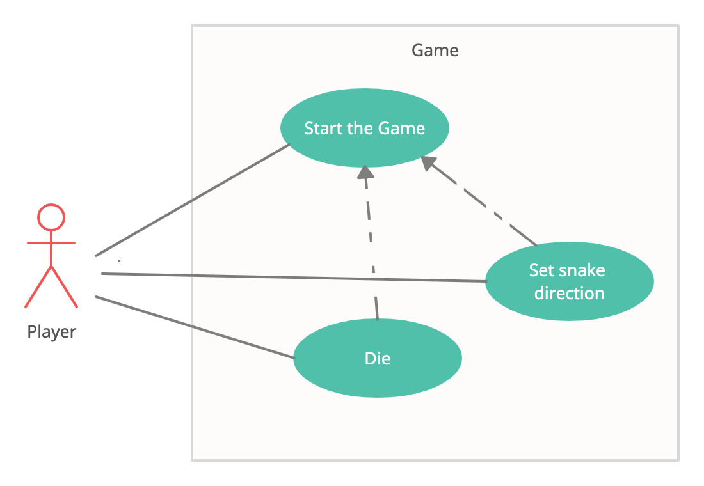

# Snake 2D

Simple graphic/game engine which interacts through the arrow keys (up, down, right and left) to set the direction of 
the snake around the board in order to find its food, when it finds it the snake will grow larger; the game ends when 
the snake moves off the screen or its own lines cross. The goal is to make the snake as large
as possible. 
For the graphics I will only use native java draw functions.

### Use case diagram

### UML diagram